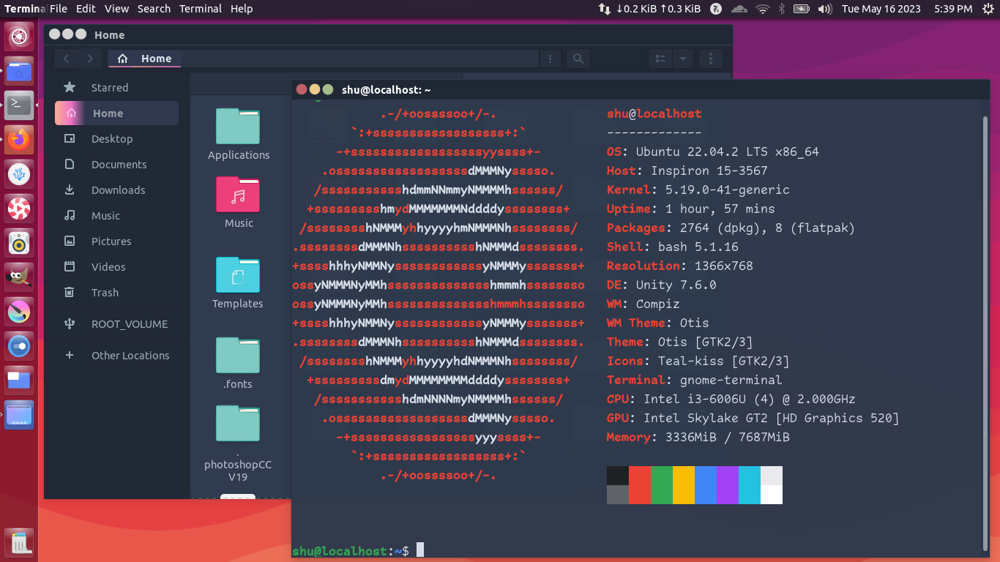
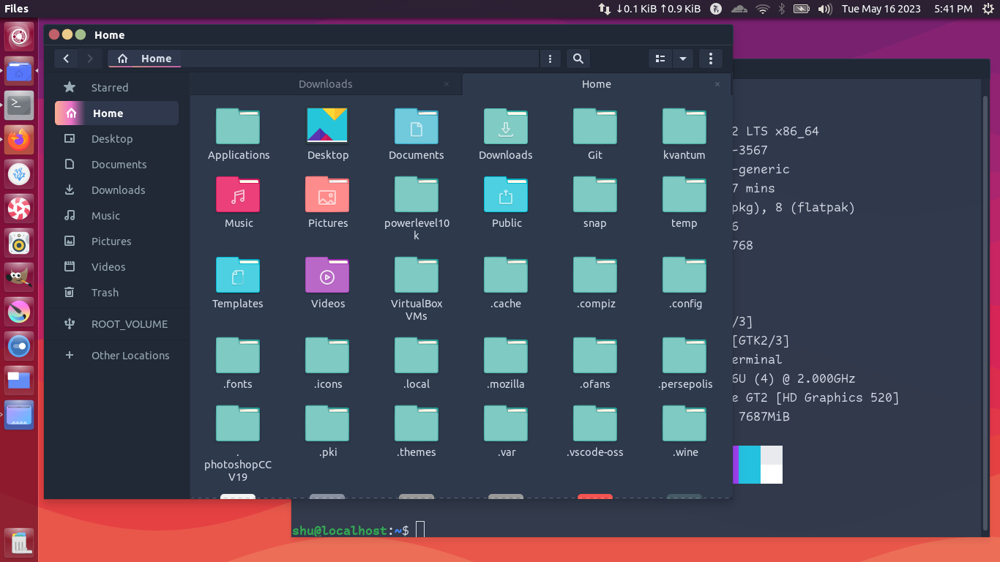
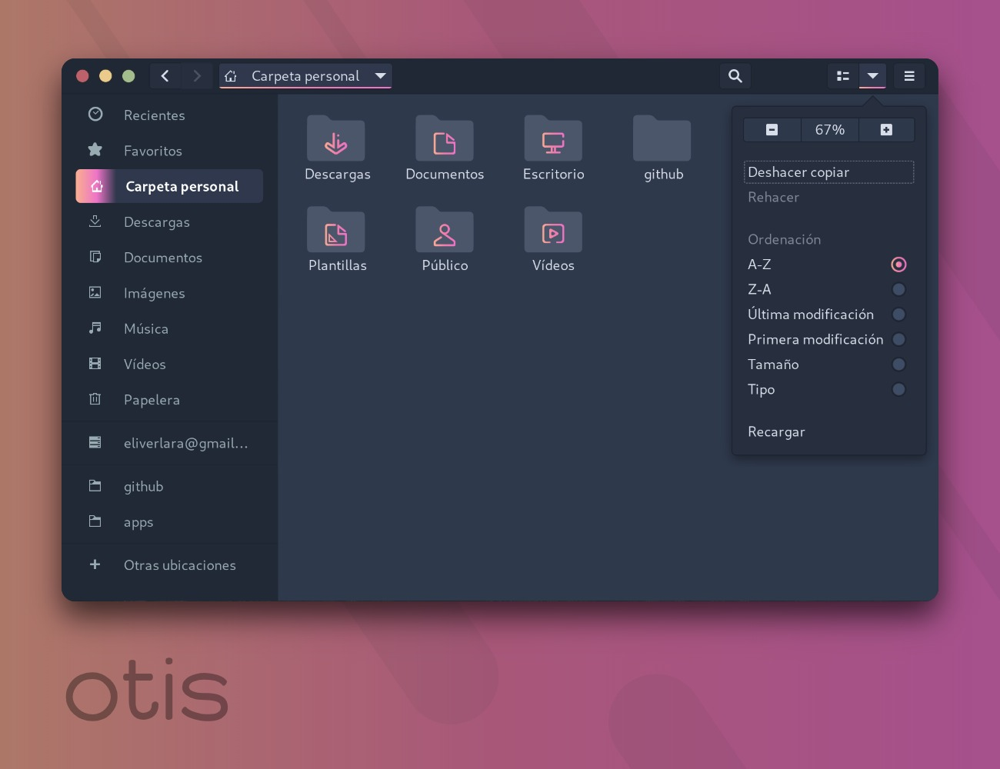

> An elegant dark theme for gnome

#### Installation

Extract the zip file to the themes directory i.e. `/usr/share/themes/` or `~/.themes/` (create it if necessary).

To set the theme on Gnome, run the following commands in Terminal:

```
gsettings set org.gnome.desktop.interface gtk-theme "Otis"
gsettings set org.gnome.desktop.wm.preferences theme "Otis"
```
or Change via distribution specific tool.


----------------------------------------------
you can change title actions button by replacing files inside unity folder from unity.standard folder
----------------------------------------------

if you want bigger actin buttons copy all files of folder unity20x20 and paste it to unity folder

--------------------------------------------------
